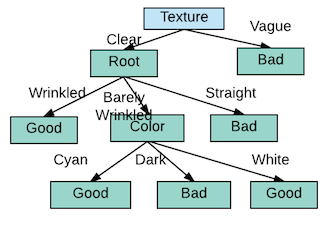

# Random Forest and Decision Tree

By: Xuewen Yang, michelyang1990@gmail.com, 11/19/2017

A tutorial on random forest and decision tree.
Before talking about Random Forest, let's discuss DT first.

## An easy classification question.
Is a watermelon with clear texture, wrinkled root a good melon, accoring to the below figure?


Then how to build a tree given training data? Why do we choose texture as root node, but not root or color? What is the criterion for choosing a feature attribute?

## What is a decision tree and CART?
Decision tree is a tree whose nodes are feature attributes, every branch of the node stands for the output on that feature attribute. Every leaf node is a class. Decision tree is a type of supervised learning algorithm that is mostly used in classification problems. In this technique, we split the population or sample into two or more homogeneous sets (or sub-populations) based on most significant splitter / differentiator in input variables.

example:
Let’s say we have a sample of 30 students with three variables Gender (Boy/ Girl), Class( IX/ X) and Height (5 to 6 ft). 15 out of these 30 play cricket in leisure time. Now, I want to create a model to predict who will play cricket during leisure period? In this problem, we need to segregate students who play cricket in their leisure time based on highly significant input variable among all three.


This is where decision tree helps, it will segregate the students based on all values of three variable and identify the variable, which creates the best homogeneous sets of students (which are heterogeneous to each other). In the snapshot above, you can see that variable Gender is able to identify best homogeneous sets compared to the other two variables.

As mentioned above, decision tree identifies the most significant variable and it’s value that gives best homogeneous sets of population. Now the question which arises is, how does it identify the variable and the split?

### Terminologies
See the below figure
1. **Root Node:** It represents entire population and this further gets divided into two or more homogeneous sets.
2. **Splitting:** Dividing a node into two or more sub-nodes.
3. **Decision Node:** When a sub-node splits into further sub-nodes, then it is called decision node.
4. **Leaf/ Terminal Node:** Nodes do not split is called Leaf or Terminal node.
5. **Pruning:** When we remove sub-nodes of a decision node, this process is called pruning. You can say opposite process of splitting.
6. **Branch / Sub-Tree:** A sub section of entire tree is called branch or sub-tree.
7. **Parent and Child Node:** A node, which is divided into sub-nodes is called parent node of sub-nodes where as sub-nodes are the child of parent node.


## CART - Classification and Regression Trees
Regression trees are used when dependent variable is continuous. Classification trees are used when dependent variable is categorical.

### How does a tree decide where to split ?
Decision trees use multiple algorithms to decide to split a node in two or more sub-nodes. The creation of sub-nodes increases the purity of the node wrt. the target variable. Decision tree splits the nodes on all available variables and then selects the split which results in most homogeneous sub-nodes.

Consider this dataset:

Lead Actor |   Genre   |  Hit
-----------|-----------|------
X          |   Action  |  Yes
X          |   Fiction |  Yes
X          |   Romance |  No
X          |   Action  |  Yes
Y          |   Action  |  No
Y          |   Fiction |  No
Y          |   Romance |  Yes

Let say, we want to identify the success of the movie but we can use only on variable - There are the following two ways in which this can be done:


You can clearly observe that Method 1 (Based on lead actor) splits the data best while the second method (Based on Genre) have produced mixed results. Decision Tree algorithms do similar things when it comes to select variables.

#### Entropy & Information Gain

Entropy here stands for the statistical entropy, differentiating from the one from thermodynamics which is a measure of variablility or chaos or randomness, and is defined as:


Initial entropy in the system was:


*Entropy for method 1*

For left branch


For right branch


*Information Gain = Entropy of parent - weighted average of children entropy*
which is, *0.68 - (4x0.56 + 3x0.63)/7 = 0.09*

*Information gain after method 2 split = 0.02*

Hence, method 1 gives us more information gain than method 2, thus, method 1 is a better split.

#### Gini Index

Gini index measures the impurity of data splits.

Formula:


where n is the number of classes, and P is the probability that an observation in split belongs to the class. Gini Index assumes a binary split for each of the attribute, let say T1 & T2. The Gini index of the split is given by


Which is nothing but a weighted sum of each of the impurities in split nodes. The reduction in impurity is given by:


Coming back to the movie example, the original gini index of the dataset is:


As per method 1, we have


The reduciton of the impurity is thus: *0.49-0.43=0.06*, which is higher than that of method 2, which is *0.49-0.48=0.01*

## Example - Banknote classification

### Banknote dataset

The banknote dataset involves predicting whether a given banknote is authentic given a number of measures taken from a photograph.

The dataset contains 1,372 with 5 numeric variables. It is a binary classification problem.

Below provides a list of the five variables in the dataset.
1. variance of Wavelet Transformed image (continuous).
2. skewness of Wavelet Transformed image (continuous).
3. kurtosis of Wavelet Transformed image (continuous).
4. entropy of image (continuous).
5. class (integer).
Below is a sample from the dataset
```
    3.2414,0.40971,1.4015,1.1952,0
    2.2504,3.5757,0.35273,0.2836,0
    -1.3971,3.3191,-1.3927,-1.9948,1
    0.39012,-0.14279,-0.031994,0.35084,1
```
### Create splits
A split is comprised of an attribute in the dataset and a value.

We can summarize this as the index of an attribute to split and the value by which to split rows on that attribute. This is just a useful shorthand for indexing into rows of data.

Creating a split involves three parts, the first we have already looked at which is calculating the Gini score. The remaining two parts are:

    Splitting a Dataset.
    Evaluating All Splits.

Let’s take a look at each.

#### Splitting a dataset
Splitting a dataset means separating a dataset into two lists of rows given the index of an attribute and a split value for that attribute.

Once we have the two groups, we can then use our Gini score above to evaluate the cost of the split.

Splitting a dataset involves iterating over each row, checking if the attribute value is below or above the split value and assigning it to the left or right group respectively.

Note that the right group contains all rows with a value at the index above or equal to the split value.

#### Evaluating all splits
With the Gini function above and the test split function we now have everything we need to evaluate splits.

Given a dataset, we must check every value on each attribute as a candidate split, evaluate the cost of the split and find the best possible split we could make.

Once the best split is found, we can use it as a node in our decision tree.

This is an exhaustive and greedy algorithm.

We will use a dictionary to represent a node in the decision tree as we can store data by name. When selecting the best split and using it as a new node for the tree we will store the index of the chosen attribute, the value of that attribute by which to split and the two groups of data split by the chosen split point.

Each group of data is its own small dataset of just those rows assigned to the left or right group by the splitting process. You can imagine how we might split each group again, recursively as we build out our decision tree.


#### Build a tree

Creating a root node of the tree is easy, which can be done by call the **get_split()** function using the entire dataset. Adding more nodes to the tree is more interesting.

Building a tree contains 3 parts:
1. Decide when to stop growing a tree - terminal nodes.
2. Add child nodes to an existing parent node - recursive splitting.
3. Put all the pieces together - building a tree.

##### Terminal nodes
1. Maximum three depth. Once a maximum depth of the tree is met, we must stop splitting adding new nodes. Deeper trees are more complex and are more likely to overfit the training data.
2. Minimum node records. This is the minimum number of training patterns that a given node is responsible for. Once at or below this minimum, we must stop splitting and adding new nodes. Nodes that account for too few training patterns are expected to be too specific and are likely to overfit the training data.
3. Exception. It is possible to choose a split in which all rows belong to one group. In this case, we will be unable to continue splitting and adding child nodes as we will have no records to split on one side or another.

We do stop growing at a given point, that node is called a terminal node and is used to make a final prediction.
```
    def to_terminal(group):
        outcomes = [row[-1] for row in group]
	return max(set(outcomes), key=outcomes.count)
```

##### Recursive splitting
New nodes added to an existing node are called child nodes. A node may have zero children (a terminal node), one child (one side makes a prediction directly) or two child nodes. We will refer to the child nodes as left and right in the dictionary representation of a given node.

Once a node is created, we can create child nodes recursively on each group of data from the split by calling the same function again.

1. Firstly, the two groups of data split by the node are extracted for use and deleted from the node. As we work on these groups the node no longer requires access to these data.
2. Next, we check if either left or right group of rows is empty and if so we create a terminal node using what records we do have.
3. We then check if we have reached our maximum depth and if so we create a terminal node.
4. We then process the left child, creating a terminal node if the group of rows is too small, otherwise creating and adding the left node in a depth first fashion until the bottom of the tree is reached on this branch.
5. The right side is then processed in the same manner, as we rise back up the constructed tree to the root.

```
def split(node, max_depth, min_size, depth):
	left, right = node['groups']
	del(node['groups'])
	# check for a no split
	if not left or not right:
		node['left'] = node['right'] = to_terminal(left + right)
		return
	# check for max depth
	if depth >= max_depth:
		node['left'], node['right'] = to_terminal(left), to_terminal(right)
		return
	# process left child
	if len(left) <= min_size:
		node['left'] = to_terminal(left)
	else:
		node['left'] = get_split(left)
		split(node['left'], max_depth, min_size, depth+1)
	# process right child
	if len(right) <= min_size:
		node['right'] = to_terminal(right)
	else:
		node['right'] = get_split(right)
		split(node['right'], max_depth, min_size, depth+1)
```


##### Building a tree

Building the tree involves creating the root node and calling the **split()** function that then calls itself recursively to build out the whole tree.

```
def build_tree(train, max_depth, min_size):
	root = get_split(train)
	split(root, max_depth, min_size, 1)
	return root
```

#### Make a prediction

Making predictions with a decision tree involves navigating the tree with the specifically provided row of data.

Again, we can implement this using a recursive function, where the same prediction routine is called again with the left or the right child nodes, depending on how the split affects the provided data.

We must check if a child node is either a terminal value to be returned as the prediction, or if it is a dictionary node containing another level of the tree to be considered.

Below is the **predict()** function that implements this procedure. You can see how the index and value in a given node.

You can see how the index and value in a given node is used to evaluate whether the row of provided data falls on the left or the right of the split.

```
def predict(node, row):
	if row[node['index']] < node['value']:
		if isinstance(node['left'], dict):
			return predict(node['left'], row)
		else:
			return node['left']
	else:
		if isinstance(node['right'], dict):
			return predict(node['right'], row)
		else:
			return node['right']
```

#### Banknote case study

See the code in [GitHub/xuewyang/randomforest](https://github.com/xuewyang/randomforest/tree/master/dt).

## Random Forests

### Disadvantages of DT

1. Accuracy - CART is often not as accurate as SVM and ensemble classifiers.
2. Instability - If we change the data a little, the tree structure can change a lot. So the prediction is not as straightforward as it appears. Susceptible to high variance.
3. The high variance can be reduced by creating multiple trees with different samples of the training dataset (different views of the problem) and combining their predictions.

### Bagging/bootstrap aggregation

There is a hard problem for a single tree: 


A single tree will have the following pattern, which is not a good way to separate the dataset.


If we had 25 trees and average them, then we have the following pattern.

{:height="24px" width="24px"}

If the 25 trees vote for the final prediction, then we have the following, which is more accurate.


**Bagging** is bootstrap aggregating. Fit classification or regression models to bootstrap samples from the data and combine by voting (classification) or averaging (regression). See the illustration below:


Bagging has the following characteristics:

1. A bootstrap sample is chosen at random with replacement from the data. Some observations end up in the bootstrap sample more than once, while others are not included ("out of bag").

2. Bagging reduces the variance of the base learner but has limited effect on the bias.

3. The same greedy algorithm is used to create each tree, meaning that it is likely that the same or very similar trees will be correlated. This makes the predictions similar.

### Random Forest

RF grows a forest of many trees. It grows each tree on an independent bootstrap sample from the training data. Different from bagging, it forces the decision trees to be different by limiting the features that the greedy algorithm can evaluate at each split point when creating the tree. For example, the number of attrabutes to be considered for the split is limited to be the square root of the number of input features. This will make trees to be more different from each other (uncorrelated), resulting predicitons that are more diverse and a combined prediction that often has better performance.

#### The algorithm

1. At each node:
    1. Select m variables at random out of all M possible variables.
    2. Find the best split on the selected m variables.
2. Grow the trees to maximum depth (classification).
3. Vote/average the trees to get predicitons for new data.

## References

1. [Tree based modeling](https://www.analyticsvidhya.com/blog/2016/04/complete-tutorial-tree-based-modeling-scratch-in-python/#nine)
